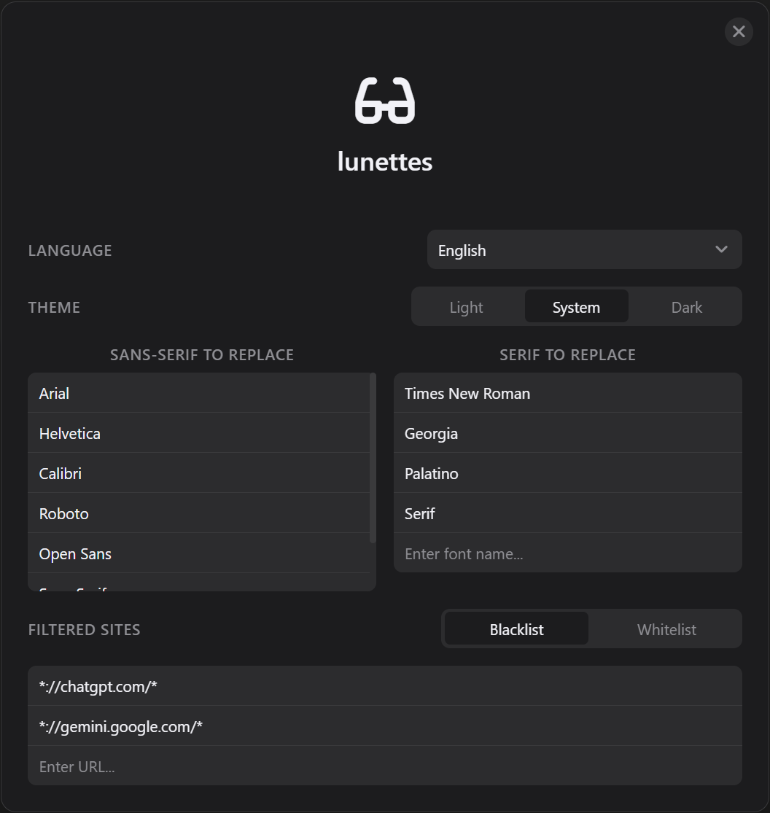

  
  
A browser script that intelligently modifies web fonts using CSS injection to achieve Bionic Reading.

---

**English** | [简体中文](./README.zh-CN.md)

# Introduction

***L*un**ettes is a Tampermonkey script that brings Bionic Reading effects to web pages. Inspired by [Fast-Font](https://github.com/Born2Root/Fast-Font), it utilizes CSS to inject custom fonts that leverage OpenType features. It achieves the visual effect of Bionic Reading without modifying any text nodes in the HTML.

> [!note]
>
> Bionic Reading is a method that guides the eyes through text via artificial fixation points. By highlighting the initial letters of words, it allows the brain to focus on these points and automatically complete the rest of the word, thereby improving reading speed and comprehension.

  

# Features

- Applies effects using CSS `@font-face` and `font-feature-settings`, ensuring high-performance rendering and compatibility with modern Web frameworks.
- Caches font data locally to reduce network requests.
- Highly customizable, allowing configuration of "bionized" fonts and website filtering.

# Installation

1. Install a user script manager, such as [Tampermonkey](https://chromewebstore.google.com/detail/tampermonkey/dhdgffkkebhmkfjojejmpbldmpobfkfo).
2. Install this script.

# Usage & Configuration

After installation, a glasses floating button will appear in the bottom right corner of the page. Click it to open the settings page.

  

- **Language**: Currently supports English and 简体中文.
- **Theme**: Supports Light, Follow System (Default), and Dark themes.
- **Font Matching Settings**: Specify which fonts on the page should be replaced with bionic fonts.
	- **Sans-serif to Replace**: Add font names, such as `Google Sans` or `Segoe UI`.
	- **Serif to Replace**: Same as above, add font names.
- **Filtered Websites**: Precisely control where ***L*un**ettes takes effect to avoid conflicts or optimize reading experiences for specific scenarios. Supports wildcards (e.g., `*://*.google.com/*`).
	- **Blacklist Mode**: The script will run on all websites **except** those in the list. (Default)
	- **Whitelist Mode**: The script will run **only** on websites in the list.

Additionally, the Tampermonkey menu provides options to toggle the floating button display and a factory reset button.

# Roadmap

- [ ] Provide a control to freely pick fonts from web page elements to enhance user experience and customization.
- [ ] Utilize [Fontsource API](https://fontsource.org/docs/api/introduction) or [Google Fonts API](https://developers.google.com/fonts/docs/developer_api) to automatically identify the classification of page fonts and intelligently apply the corresponding bionic font variants.

# Credits

- [Fast-Font](https://github.com/Born2Root/Fast-Font)
- [Inter](https://fonts.google.com/specimen/Inter): The base font for the sans-serif bionic font in this project.
- [Source Serif 4](https://fonts.google.com/specimen/Source+Serif+4): The base font for the serif bionic font in this project.
