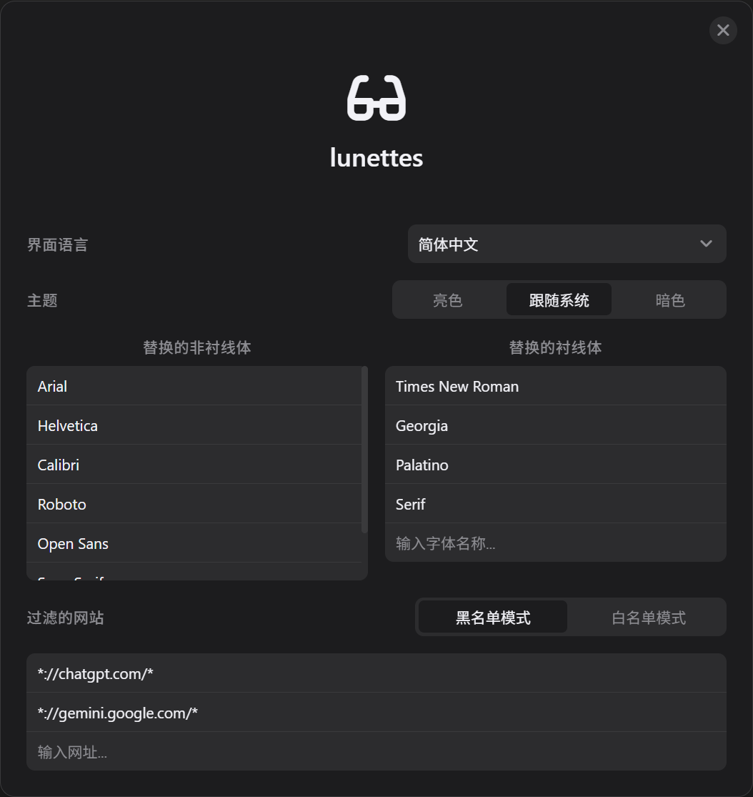

<div align="center">
  <picture>
    <source media="(prefers-color-scheme: dark)" srcset="./public/logo-dark.svg">
    
  </picture>
	<h1><b><i>L</i>un</b>ettes</h1>
  <p>一个使用 CSS 注入智能修改网页字体以实现仿生阅读的用户脚本。</p>
</div>

[English](./README.md) | **简体中文**

# 目录

- [简介](#简介)
- [特性](#特性)
- [安装与配置](#安装与配置)
- [开发](#开发)
- [未来规划](#未来规划)
- [贡献](#贡献)
- [致谢](#致谢)
- [许可证](#许可证)

# 简介

***L*un**ettes 是一款将仿生阅读效果应用到网页上的用户脚本。受到 [Fast-Font](https://github.com/Born2Root/Fast-Font) 的启发，它利用 CSS 注入了使用 OpenType 特性的自定义字体。在不修改 HTML 中任何文本节点的情况下实现仿生阅读 (Bionic Reading) 的视觉效果。

> [!note]
>
> 仿生阅读是一种通过人工注视点引导眼睛阅读文本的方法。通过高亮单词的首字母，它让大脑聚焦于这些点并自动补全单词的其余部分，从而提高阅读速度和理解能力。

<div align="center">
  
</div>

<p align="center">来源：<a href="https://www.theatlantic.com/ideas/2026/01/war-empathy-hillary-clinton/685809/">The Atlantic</a></p>

# 特性

- 使用 CSS `@font-face` 和 `font-feature-settings` 应用效果，确保高性能渲染且与现代 Web 框架兼容。
- 本地缓存字体数据以减少网络请求。
- 高度自定义，允许配置被“仿生化”的字体和过滤的网站。

# 安装与配置

1. 安装一个用户脚本管理器，如 [Tampermonkey](https://chromewebstore.google.com/detail/tampermonkey/dhdgffkkebhmkfjojejmpbldmpobfkfo)。
2. 安装本脚本。

安装后，页面右下角会出现一个眼镜悬浮按钮，点击打开设置页。

<div align="center">
  
</div>

- 界面语言：目前支持 English 和简体中文。
- 主题：支持亮色、跟随系统（默认）和暗色主题。
- 字体匹配设置：指定页面上的哪些字体应该被替换成仿生字体。
	- 替换的非衬线体：添加字体名称，如 `Google Sans` 或 `Segoe UI`。
	- 替换的衬线体：同上，添加字体名称。
- 过滤的网站：精准控制 ***L*un**ettes 在哪些网站生效，避免冲突或优化特定场景的阅读体验，支持通配符（例如 `*://*.google.com/*`）。
	- 黑名单模式：脚本将在**除了**列表内网站之外的所有网站运行。（默认）
	- 白名单模式：脚本**仅在**列表内的网站运行。

除此之外，油猴菜单中提供了悬浮按钮显示开关和恢复出厂设置按钮。

# 开发

```bash
git clone https://github.com/2005czq/lunettes.git # 克隆仓库
pnpm install # 安装依赖
pnpm run dev # 启动开发服务器
pnpm run build # 构建项目
```

# 未来规划

- [ ] 提供自由获取网页元素字体的控件，以提升用户体验和定制化程度。
- [ ] 利用 [Fontsource API](https://fontsource.org/docs/api/introduction) 或 [Google Fonts API](https://developers.google.com/fonts/docs/developer_api) 自动识别页面字体的分类，并智能应用对应的仿生字体变体。

# 贡献

欢迎提交 Pull Request！您可以通过以下方式贡献：

- 添加更多语言支持（i18n）
- 改进用户界面
- 修复错误
- 添加新功能

对于 i18n 贡献，请：
- 在 `src/lib/i18n/` 目录中添加翻译
- 提供翻译后设置页的截图（创建新的 `public/seettings.<lang>.png` 文件）
- 翻译 README（创建新的 `README.<lang>.md` 文件）

# 致谢

- [Fast-Font](https://github.com/Born2Root/Fast-Font)
- [Inter](https://fonts.google.com/specimen/Inter): 本项目中无衬线仿生字体的基础字体。
- [Source Serif 4](https://fonts.google.com/specimen/Source+Serif+4): 本项目中衬线仿生字体的基础字体。

# 许可证

本项目采用 [MIT 许可证](LICENSE)。